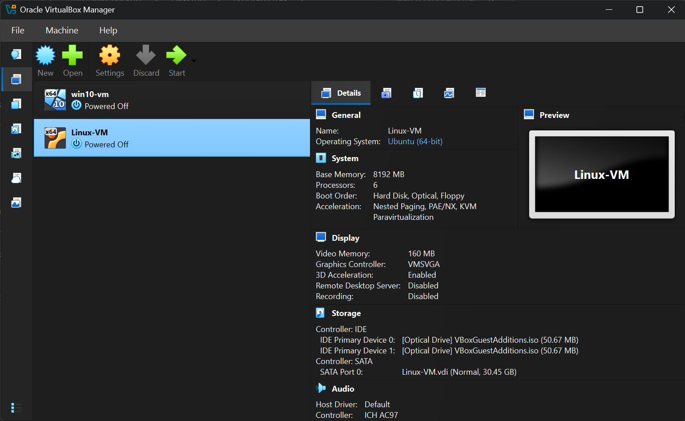
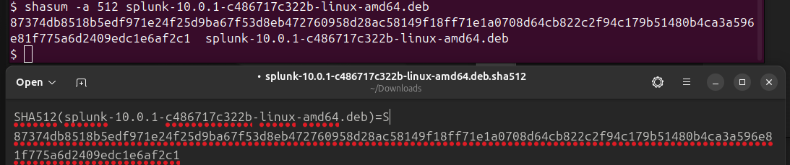
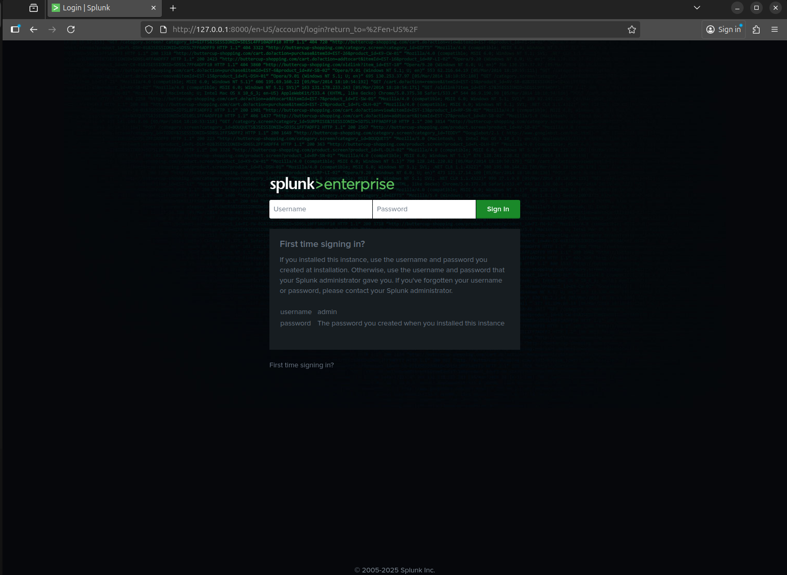
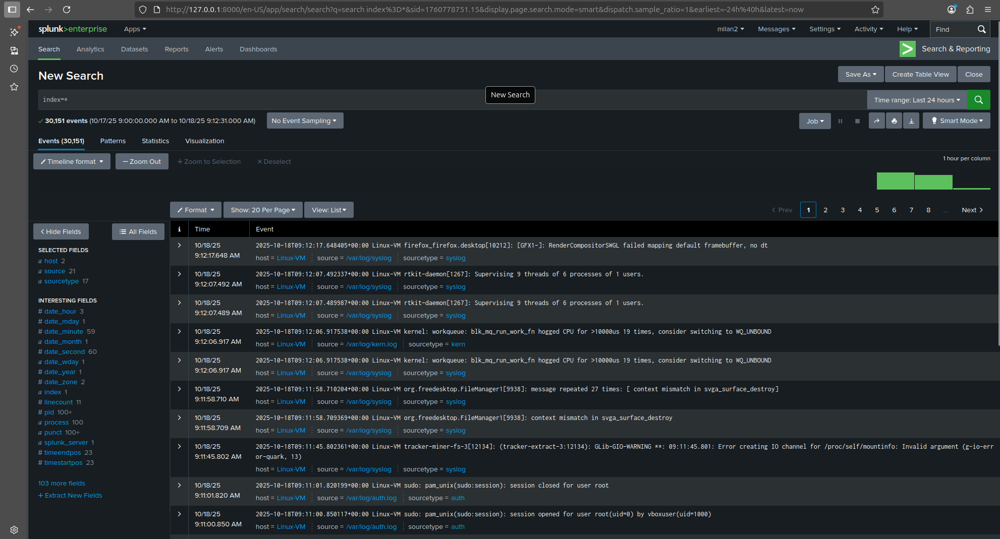
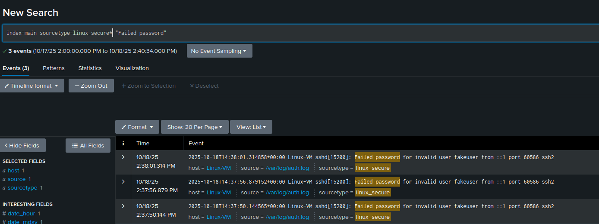
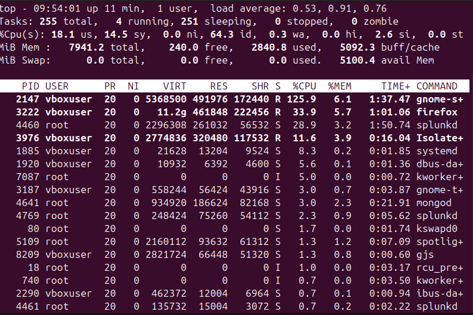
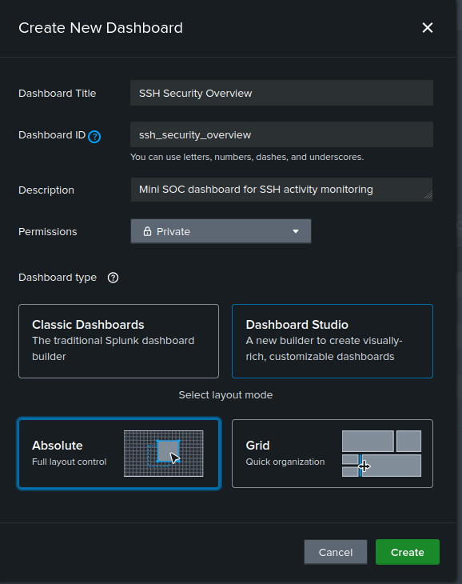
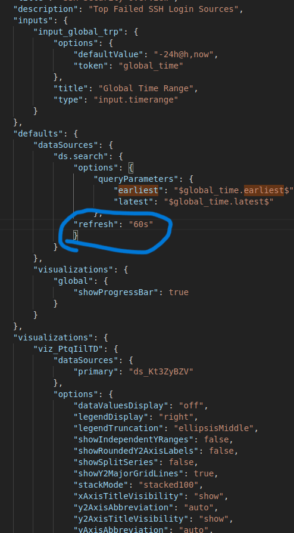
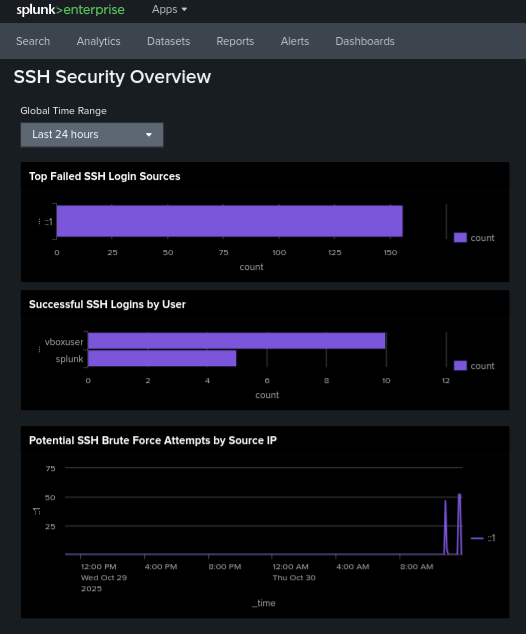

# Splunk Home-Lab

This repository documents my **Splunk home-lab project**, created to demonstrate  my ability to install, configure, and use Splunk for basic log monitoring and  security analysis.  
It was built and tested on **Ubuntu (VirtualBox)**.

---

## Project overview

The goal was to set up Splunk inside a VirtualBox Ubuntu VM, collect system logs  from `/var/log`, and visualize SSH login activity on a custom dashboard.

I used this project to practice troubleshooting, system monitoring, and creating  Splunk searches and dashboards.

---

## Step-by-step setup

### 1️. Virtual machine setup

- Created an Ubuntu VM in **VirtualBox**  




- Installed drivers  
  `sudo ubuntu-drivers autoinstall`

- Updated packages  
  `sudo apt update && sudo apt upgrade`

- Rebooted the machine  
  `sudo reboot`

---

### 2️. Splunk installation

- Downloaded Splunk  

`wget -O splunk-10.0.1-c486717c322b-linux-amd64.deb`  
"https://download.splunk.com/products/splunk/releases/10.0.1/linux/splunk-10.0.1-c486717c322b-linux-amd64.deb"


- Verified file integrity  
  `shasum -a 512 splunk-10.0.1-c486717c322b-linux-amd64.deb`  



- Installed and started Splunk  
```
  sudo dpkg -i splunk-10.0.1-c486717c322b-linux-amd64.deb
  sudo /opt/splunk/bin/splunk start --accept-license
```

- Created an admin account and logged in at  
  http://127.0.0.1:8000  



---

### 3️. Adding logs to Splunk

- Added `/var/log` directory as a monitored source  
`sudo /opt/splunk/bin/splunk add monitor /var/log`

- Logs appeared in Splunk search view  




---

### 4️. Troubleshooting VM performance

- The VM froze multiple times — using `top`, I noticed high CPU usage.  
- Increased the CPU cores and video memory in VirtualBox.  
- The system stabilized afterward.  



---

### 5️. Display quality fix

- The resolution looked bad even at high settings.  
- After researching and using ChatGPT for guidance, I installed proper VirtualBox Guest Additions to fix it.  

---

### 6️. SSH logging and dashboard

- Installed SSH server  
`sudo apt install openssh-server`  

- Generated login attempts (both failed and successful)  
- Created a dashboard named “SSH Security Overview”  
- Added multiple searches as panels  
- Set dashboard refresh to 60 seconds (in JSON settings)  


  
  - **Failed SSH logins**
 ```index=main sourcetype=linux_secure "Failed password"
| rex "from\s(?<src_ip>[0-9a-fA-F\.:]+)"
| stats count by src_ip
| sort - count
```  

- **Successful SSH logins**
```
index=main sourcetype=linux_secure "Accepted password"
| rex "for\s(?<user>\S+)"
| stats count by user
| sort - count
```

- **Potential brute-force attempts**
```
index=main sourcetype=linux_secure "Failed password"
| rex "from\s(?<src_ip>[0-9a-fA-F\.:]+)"
| timechart span=5m count by src_ip
```  


---

## Dashboard detection examples


---

## Lessons learned

- Setting up Splunk from scratch gives a better understanding of log sources and inputs.  
- Monitoring `/var/log` is a good way to practice analyzing system behavior.  
- Troubleshooting VM resources and display issues builds practical system administration skills.  
- Creating dashboards helps visualize and understand real-time log data.

This home-lab shows I can:
- Install and configure Splunk on Linux
- Collect and analyze logs
- Troubleshoot performance problems
- Build dashboards for security visibility

