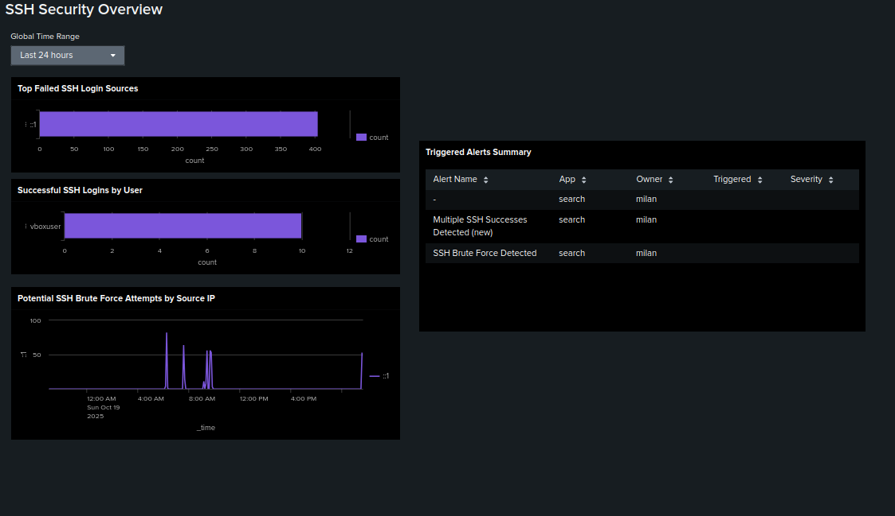

# Splunk Home-Lab

This repository documents my **Splunk home-lab project**, created to demonstrate my ability to install, configure, and use Splunk for basic log monitoring and security analysis.  
It was built and tested on **Ubuntu (VirtualBox)**.

---

## 🧠 Project overview

The goal was to set up Splunk inside a VirtualBox Ubuntu VM, collect system logs from `/var/log`, and visualize SSH login activity on a custom dashboard.

I used this project to practice troubleshooting, system monitoring, and creating Splunk searches and dashboards.

---

## ⚙️ Step-by-step setup

### 1️⃣ Virtual machine setup

- Created an Ubuntu VM in **VirtualBox**
- Installed drivers  
  ```bash
  sudo ubuntu-drivers autoinstall
  ```
- Updated packages  
  ```bash
  sudo apt update && sudo apt upgrade
  ```
- Rebooted the machine  
  ```bash
  sudo reboot
  ```


---

### 2️⃣ Splunk installation

- Downloaded Splunk  
  ```bash
  wget -O splunk-10.0.1-c486717c322b-linux-amd64.deb "https://download.splunk.com/products/splunk/releases/10.0.1/linux/splunk-10.0.1-c486717c322b-linux-amd64.deb"
  ```

- Verified file integrity  
  ```bash
  shasum -a 512 splunk-10.0.1-c486717c322b-linux-amd64.deb
  ```


- Installed and started Splunk  
  ```bash
  sudo dpkg -i splunk-10.0.1-c486717c322b-linux-amd64.deb
  sudo /opt/splunk/bin/splunk start --accept-license
  ```

- Created an admin account and logged in at  
  👉 http://127.0.0.1:8000


---

### 3️⃣ Adding logs to Splunk

- Added `/var/log` directory as a monitored source  
  ```bash
  sudo /opt/splunk/bin/splunk add monitor /var/log
  ```

- Logs appeared in Splunk search view  


---

### 4️⃣ Troubleshooting VM performance

- The VM froze multiple times — using `top`, I noticed high CPU usage.  
- Increased the **CPU cores and video memory** in VirtualBox.  
- The system stabilized afterward.  


---

### 5️⃣ Display quality fix

- The resolution looked bad even at high settings.  
- After researching and using ChatGPT for guidance, I installed proper VirtualBox Guest Additions to fix it.  

---

### 6️⃣ SSH logging and dashboard

- Installed SSH server  
  ```bash
  sudo apt install openssh-server
  ```

- Generated login attempts (both failed and successful)  
- Created a **dashboard** named “SSH Security Overview”  
- Added multiple searches as panels  
- Set dashboard refresh to **60 seconds** (in JSON settings)




---

## 🧩 Dashboard detection examples

- **Failed SSH logins**  
- **Successful SSH logins**  
- **Potential brute-force attempts**

---

## 📁 Repository contents

```
splunk-homelab/
├── README.md
├── commands.txt
├── notes.md
└── screenshots/
    ├── 1VM_settigs.png
    ├── 2new_linuxVM.png
    ├── 3compare_hash.png
    ├── 4splunk_login.png
    ├── 5first_logs.png
    ├── 6more_logs.png
    ├── 7cpu_usage.png
    ├── 8create_new_dashboard.png
    ├── 9refresh_60sec.png
    └── 10SSH_Sec_overview.png
```

---

## 💡 Lessons learned

- Setting up Splunk from scratch gives a better understanding of log sources and inputs.  
- Monitoring `/var/log` is a good way to practice analyzing system behavior.  
- Troubleshooting VM resources and display issues builds practical system administration skills.  
- Creating dashboards helps visualize and understand real-time log data.

---

## 🗣️ Interview summary

This home-lab shows I can:
- Install and configure Splunk on Linux
- Collect and analyze logs
- Troubleshoot performance problems
- Build dashboards for security visibility

---

**Author:** Milán Székely  
**Environment:** Ubuntu 22.04 LTS (VirtualBox)  
**Goal:** SOC Analyst / Cybersecurity learning project  
