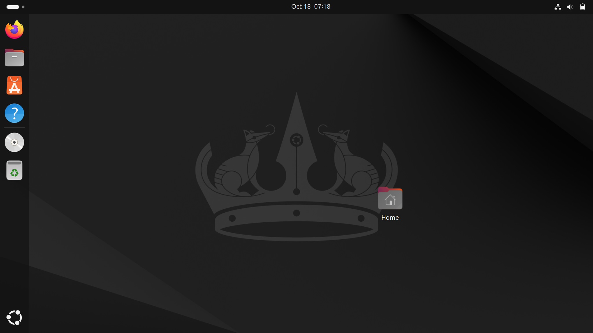

# Splunk Home-Lab

This repository documents my **Splunk home-lab project**, created to demonstrate  my ability to install, configure, and use Splunk for basic log monitoring and  security analysis.  
It was built and tested on **Ubuntu (VirtualBox)**.

---

## Project overview

The goal was to set up Splunk inside a VirtualBox Ubuntu VM, collect system logs  from `/var/log`, and visualize SSH login activity on a custom dashboard.

I used this project to practice troubleshooting, system monitoring, and creating  Splunk searches and dashboards.

---

## Step-by-step setup

### 1️. Virtual machine setup

- Created an Ubuntu VM in **VirtualBox**  




- Installed drivers  
  `sudo ubuntu-drivers autoinstall`

- Updated packages  
  `sudo apt update && sudo apt upgrade`

- Rebooted the machine  
  `sudo reboot`

---

### 2️. Splunk installation

- Downloaded Splunk  

`wget -O splunk-10.0.1-c486717c322b-linux-amd64.deb`  
"https://download.splunk.com/products/splunk/releases/10.0.1/linux/splunk-10.0.1-c486717c322b-linux-amd64.deb"


- Verified file integrity  
  `shasum -a 512 splunk-10.0.1-c486717c322b-linux-amd64.deb`  


- Installed and started Splunk  
```
  sudo dpkg -i splunk-10.0.1-c486717c322b-linux-amd64.deb
  sudo /opt/splunk/bin/splunk start --accept-license
```

- Created an admin account and logged in at  
  http://127.0.0.1:8000  


---

### 3️. Adding logs to Splunk

- Added `/var/log` directory as a monitored source  
`sudo /opt/splunk/bin/splunk add monitor /var/log`

- Logs appeared in Splunk search view  


---

### 4️. Troubleshooting VM performance

- The VM froze multiple times — using `top`, I noticed high CPU usage.  
- Increased the CPU cores and video memory in VirtualBox.  
- The system stabilized afterward.  


---

### 5️. Display quality fix

- The resolution looked bad even at high settings.  
- After researching and using ChatGPT for guidance, I installed proper VirtualBox Guest Additions to fix it.  

---

### 6️. SSH logging and dashboard

- Installed SSH server  
`sudo apt install openssh-server`  

- Generated login attempts (both failed and successful)  
- Created a dashboard named “SSH Security Overview”  
- Added multiple searches as panels  
- Set dashboard refresh to 60 seconds (in JSON settings)  


  
  

- **Failed SSH logins**  
 ```index=main sourcetype=linux_secure "Failed password"
| rex "from\s(?<src_ip>[0-9a-fA-F\.:]+)"
| stats count by src_ip
| sort - count
```  

- **Successful SSH logins**  
```
index=main sourcetype=linux_secure "Accepted password"
| rex "for\s(?<user>\S+)"
| stats count by user
| sort - count
```  

- **Potential brute-force attempts**  
```
index=main sourcetype=linux_secure "Failed password"
| rex "from\s(?<src_ip>[0-9a-fA-F\.:]+)"
| timechart span=5m count by src_ip
```  

---  
  
## After these I switched to Windows VM anddownloaded the BOTS V3 Dataset and  
## unziped the files into  
`$SPLUNK_HOME/etc/apps` 

---

### 1. Downloading the dataset  

  

---

### 2. Making sure botsv3 is imported properly with  
`index=botsv3`  


---

### 3. Next I searched for errors with a host named serverless  
### and excluded some AWS audit logs with the search command:  
`index=botsv3 error host=serverless NOT sourcetype="aws:rds:audit"`  

  

---

### 4. Now I created tables using the search command:  
```
index=botsv3 sourcetype=WinEventLog:Security (EventCode=4624 OR EventCode=4625)  
| transaction host maxpause=30  
| table _time Account_Name host EventCode duration  
```  
This means:
- Search in botsv3 databse
- in security logs
- successful (4624) and failed (4625) logins
- group the events from the same host into one transaction
- if the time gap between them is less than 30 minutes
- then create the tables: _time, Account_Name, host, EventCode, duration  

  

---

### 5. Next I created dashboards using the following commands:  

`index=botsv3 | timechart count by status_code`  

- This search creates a time-based chart showing how values change over time
- Counts how many events occurred
- Groups events by their status code  

  
```
index=botsv3 sourcetype=WinEventLog:Security EventCode=4624  
| timechart count by host limit=5
```  

- This search filters Security events only
- Searches for successful security logons (4624)
- Creats a time-based chart showing the top 5 hosts with the most events  

  

---

### 6. For the last step I created an alert that notices mass file modifications  

```
index=botsv3 sourcetype=file_modifications  
| stats  count by file_path, user  
| where count > 50
```  

- This filters event based on file modification
- Counts how many times each user modified each file
- Shows file_path, user, count
- where the file was modified more than 50 times  

  

This alert triggers mass file modifications, ransomware attack or scripting activites.  

---  

## Lessons learned

- Setting up Splunk from scratch gives a better understanding of log sources and inputs.  
- Monitoring `/var/log` is a good way to practice analyzing system behavior.  
- Troubleshooting VM resources and display issues builds practical system administration skills.  
- Creating dashboards helps visualize and understand real-time log data.
- Using real-world logs for real-world experience

This home-lab shows I can:
- Install and configure Splunk on Linux and Windows
- Collect and analyze logs
- Troubleshoot performance problems
- Create alerts
- Build dashboards for security visibility


